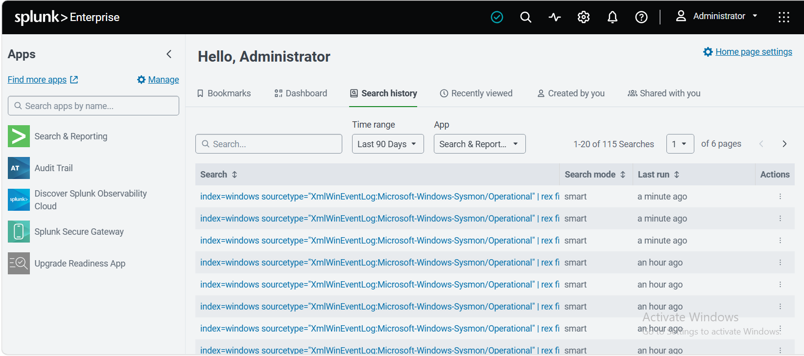
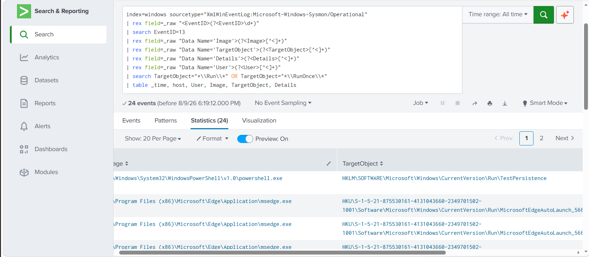
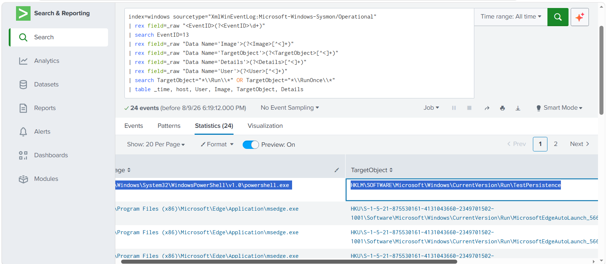
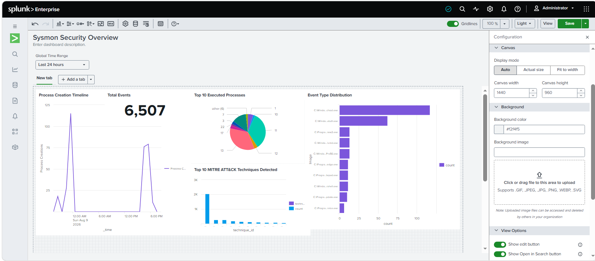
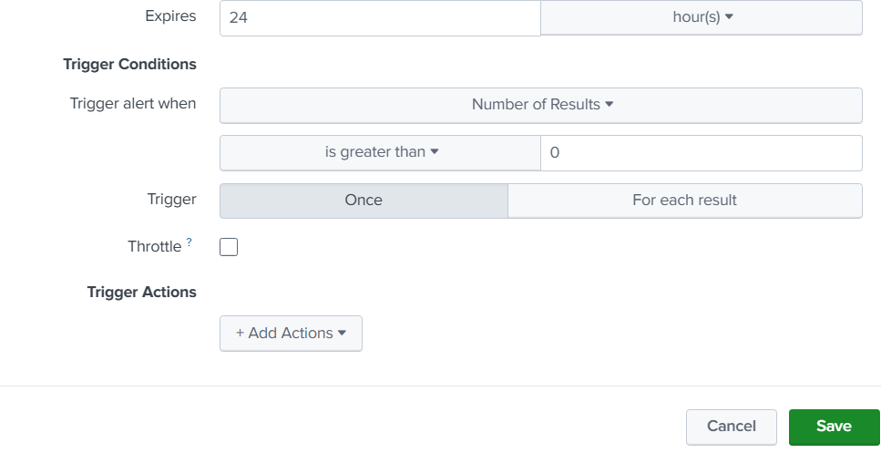
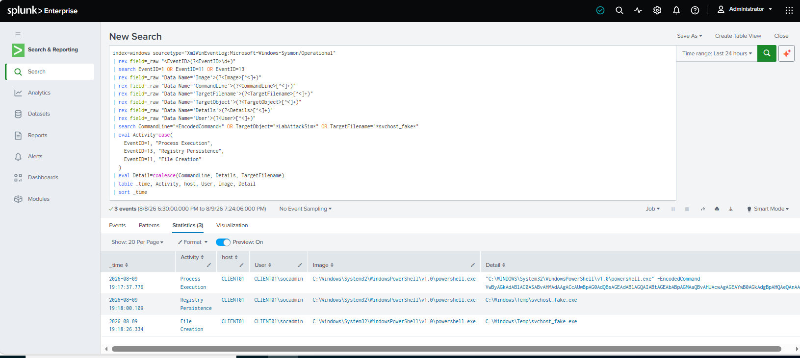
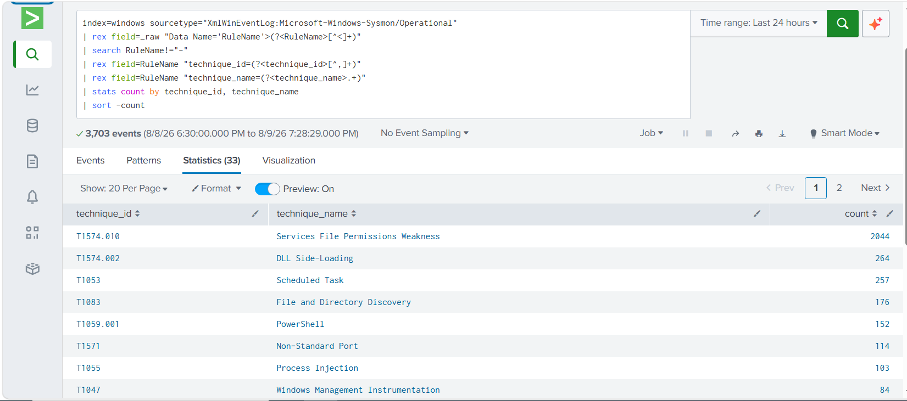

# Splunk SIEM & SOC Detection Enterprise Lab

<p align="center">


</p>

---

## Business Scenario

Modern Security Operations Centers rely on centralized log collection and correlation to detect malicious activity across an organization's endpoints. To simulate a real-world SOC environment, Splunk Enterprise was deployed on a dedicated server, and a Windows 11 endpoint was configured to forward both native Windows Security logs and Sysmon telemetry via the Splunk Universal Forwarder.

This lab documents the full workflow of ingesting endpoint data into Splunk, building custom field extractions, writing detection queries (SPL), building dashboards, configuring real-time alerts, simulating an attack chain, and mapping detected behaviors to the MITRE ATT&CK Framework.

---

# Project Overview

This repository documents the deployment and configuration of Splunk Enterprise as a centralized SIEM, ingesting Windows Security Event Logs and Sysmon logs from a Windows 11 endpoint through the Splunk Universal Forwarder.

The primary objective is to understand how a SOC Analyst collects, parses, searches, and correlates endpoint telemetry inside a SIEM, and how raw log data is transformed into actionable detections mapped to real-world adversary techniques.

---

# Objectives

- Deploy Splunk Enterprise and understand its architecture
- Install and configure Splunk Universal Forwarder on Windows 11
- Forward Windows Security Logs and Sysmon Logs to Splunk
- Create and manage Splunk Indexes and Sourcetypes
- Perform searches and master SPL (Search Processing Language) fundamentals
- Work with Fields, Filters, and Time Range controls
- Analyze Windows Security Events (Logon/Logoff, Account activity)
- Analyze Sysmon Events (Process Creation, Network Connections, File Creation, Registry Modification)
- Build Reports and interactive Dashboards
- Configure real-time Alerts for suspicious behavior
- Simulate a multi-stage attack chain and reconstruct it as an Incident Timeline
- Map detected events to the MITRE ATT&CK Framework

---

# Lab Environment

| Component          | Configuration                                      |
| ------------------ | -------------------------------------------------- |
| Hypervisor         | VMware Workstation Pro                             |
| SIEM Server        | Windows Server + Splunk Enterprise (Trial License) |
| Endpoint OS        | Windows 11                                         |
| Log Shipping       | Splunk Universal Forwarder                         |
| Endpoint Telemetry | Microsoft Sysmon (SwiftOnSecurity Configuration)   |
| Log Sources        | Windows Security Event Log, Sysmon Operational Log |

---

# Lab Architecture

> SIEM Log Collection & Detection Workflow

```text
+--------------------------+
|   Windows 11 Endpoint    |
|  (Sysmon + Security Log) |
+------------+-------------+
             |
             | Universal Forwarder
             |
             v
+--------------------------+
|   Splunk Enterprise      |
|   (Indexing & Parsing)   |
+------------+-------------+
             |
             | SPL Search & Field Extraction
             |
             v
+--------------------------+
|   Reports & Dashboards   |
+------------+-------------+
             |
             | Trigger Conditions
             |
             v
+--------------------------+
|         Alerts           |
+------------+-------------+
             |
             | Investigation
             |
             v
+--------------------------+
|  MITRE ATT&CK Mapping    |
+--------------------------+
```

---

# Project Scope

The following components have been implemented in this lab:

- Splunk Enterprise Deployment
- Splunk Architecture Fundamentals
- Universal Forwarder Configuration
- Windows Security Log Ingestion
- Sysmon Log Ingestion
- Custom Index Creation
- SPL Search Fundamentals
- Field Extraction (rex)
- Time Range & Filter Analysis
- Windows Security Event Analysis
- Sysmon Event Analysis (Process, Network, File, Registry)
- Reports & Dashboard Creation (Dashboard Studio)
- Real-time Alert Configuration
- Simulated Attack Chain (SOC Detection Lab)
- MITRE ATT&CK Technique Mapping

---

# Security Relevance

Splunk enables centralized visibility across an organization's endpoints by aggregating raw log data into a searchable index. Combined with Sysmon's granular endpoint telemetry, SOC Analysts can investigate process execution, persistence mechanisms, network activity, and registry modifications — correlating isolated events into a complete attack timeline and mapping adversary behavior to the MITRE ATT&CK Framework.

---

# Technical Skills Demonstrated

- Splunk Enterprise Deployment & Architecture
- Universal Forwarder Configuration
- Index & Sourcetype Management
- SPL (Search Processing Language) Fundamentals
- Manual Field Extraction using `rex`
- Time Range & Filter-based Investigation
- Windows Security Event Analysis
- Sysmon Endpoint Telemetry Analysis
- Statistical Analysis (`stats`, `chart`, `timechart`)
- Dashboard Studio (Line, Bar, Pie, Single Value Panels)
- Alert Configuration & Trigger Conditions
- Attack Chain Simulation & Timeline Reconstruction
- MITRE ATT&CK Technique Mapping

---

# Project Gallery

## Splunk Deployment & Log Ingestion (Sessions 2–5)

Covers Splunk Enterprise installation, Universal Forwarder configuration on Windows 11, and Index/Sourcetype setup for Windows Security and Sysmon logs.




---

## SPL Fundamentals & Field Extraction (Sessions 6–9)

Covers basic searching, SPL syntax, Field/Time Range filtering, manual field extraction with `rex`, and Windows Security Event analysis.




---

## Sysmon Endpoint Analysis (Session 10)

Covers analysis of Process Creation (Event ID 1), File Creation (Event ID 11), and Registry Modification (Event ID 13), including a manual Registry Run Key persistence test.




---

## Reports & Security Dashboard (Session 11)

Covers converting SPL queries into saved Reports and building a multi-panel Security Dashboard using Dashboard Studio.




---

## Alert Configuration (Session 12)

Covers configuring a scheduled Alert with Trigger Conditions for Registry Persistence detection, and verifying it under Triggered Alerts.




---

## SOC Detection Lab — Attack Chain Timeline (Session 13)

Covers simulating a 3-stage attack (Encoded PowerShell Execution → Registry Persistence → File Masquerading) and reconstructing it as a single Unified Timeline using `eval`, `case`, and `coalesce`.




---

## MITRE ATT&CK Technique Mapping (Session 14)

Covers parsing the Sysmon `RuleName` field to extract `technique_id`/`technique_name`, and validating that the simulated attack chain correctly maps to real MITRE ATT&CK techniques.




---

# Detection Scenarios

The following detection-oriented scenarios were demonstrated during this lab:

- Suspicious Process Execution from Temp/AppData directories
- Encoded PowerShell Command Detection
- Registry Run Key Persistence Detection
- File Creation Monitoring in Sensitive Directories
- Full Attack Chain Simulation (Execution → Persistence → Defense Evasion)
- Real-time Alerting on Persistence and Encoded Command Behavior
- MITRE ATT&CK Technique Coverage Analysis

---

# MITRE ATT&CK Mapping

| Simulated Behavior                              | Sysmon Event | MITRE ATT&CK Technique                                           |
| ----------------------------------------------- | ------------ | ---------------------------------------------------------------- |
| Encoded PowerShell Execution                    | Event ID 1   | T1059.001 – Command and Scripting Interpreter: PowerShell        |
| Registry Run Key Persistence                    | Event ID 13  | T1547.001 – Boot or Logon Autostart Execution: Registry Run Keys |
| Suspicious File Masquerading (svchost_fake.exe) | Event ID 11  | T1036 – Masquerading                                             |
| Process Execution from Temp/AppData             | Event ID 1   | T1204 – User Execution                                           |
| Network Connection Monitoring                   | Event ID 3   | T1071 – Application Layer Protocol                               |

> **Note:** The mappings above represent the attack scenarios demonstrated in this lab. In real-world investigations, MITRE ATT&CK techniques depend on the full context of the activity rather than the Sysmon Event ID alone. The Sysmon configuration used in this lab (SwiftOnSecurity) automatically tags many events with `technique_id` and `technique_name` fields inside the `RuleName` field.

---

# Enterprise Design Highlights

- Centralized SIEM Log Collection (Splunk Enterprise)
- Universal Forwarder-based Log Shipping
- Custom Field Extraction without relying on pre-built Add-ons
- Statistical & Time-based Correlation (stats, chart, timechart)
- Interactive Security Dashboards (Dashboard Studio)
- Real-time Alerting with Trigger Conditions
- End-to-end Attack Chain Reconstruction
- MITRE ATT&CK-based Detection Coverage Analysis

---

# Lessons Learned

During this project I gained practical experience with:

- Deploying and architecting Splunk Enterprise
- Configuring Universal Forwarder for Windows log shipping
- Managing Splunk Indexes and Sourcetypes
- Writing SPL queries from basic searches to advanced correlation
- Manually extracting fields from raw XML logs using `rex` (without relying on pre-built Add-ons)
- Analyzing Windows Security Events and Sysmon Telemetry
- Building Reports and multi-panel Dashboards
- Configuring real-time Alerts with custom Trigger Conditions
- Simulating a realistic attack chain and reconstructing it as an Incident Timeline
- Mapping detected behavior to the MITRE ATT&CK Framework

---

# Future Work

The infrastructure created in this repository will be extended with:

- Windows Event Forwarding (WEF) at scale
- Additional Log Sources (Sysmon DNS, Firewall, Proxy Logs)
- Splunk Add-on / CIM Data Model Normalization
- Advanced Correlation Searches & Risk-Based Alerting
- Threat Hunting Playbooks
- Incident Response Documentation
- SOAR Integration

---

# Repository Status

| Module                                                | Status |
| ----------------------------------------------------- | ------ |
| Splunk Enterprise Deployment                          | ✅     |
| Universal Forwarder Configuration                     | ✅     |
| Windows Security Log Ingestion                        | ✅     |
| Sysmon Log Ingestion                                  | ✅     |
| Index & Sourcetype Management                         | ✅     |
| SPL Fundamentals                                      | ✅     |
| Field Extraction (rex)                                | ✅     |
| Windows Security Event Analysis                       | ✅     |
| Sysmon Event Analysis (Process/Network/File/Registry) | ✅     |
| Reports & Dashboards                                  | ✅     |
| Alert Configuration                                   | ✅     |
| SOC Detection Lab (Attack Chain Simulation)           | ✅     |
| MITRE ATT&CK Mapping                                  | ✅     |
| GitHub Documentation                                  | ✅     |

---

# Author

**Mahdi Khazaee**

Cybersecurity Portfolio
